<div align="center">

<h1>🌍 Wayanad Risk Observatory</h1>

<h3>Multi-Hazard Risk Mapping &amp; Emergency Routing</h3>

<p><strong>Observe the landscape. Understand the risk. Find a safer route.</strong></p>

<p>Satellite-powered geospatial decision support for Wayanad District, Kerala, India.</p>

<p>
  
  
  
  
</p>

<p>
  <a href="#project-at-a-glance">Project</a> &nbsp;·&nbsp;
  <a href="#visual-tour">Visual tour</a> &nbsp;·&nbsp;
  <a href="#run-it-on-localhost">Launch the map</a> &nbsp;·&nbsp;
  <a href="#results-of-the-reference-run">Results</a> &nbsp;·&nbsp;
  <a href="#setup-and-running-the-pipeline">Get started</a>
</p>

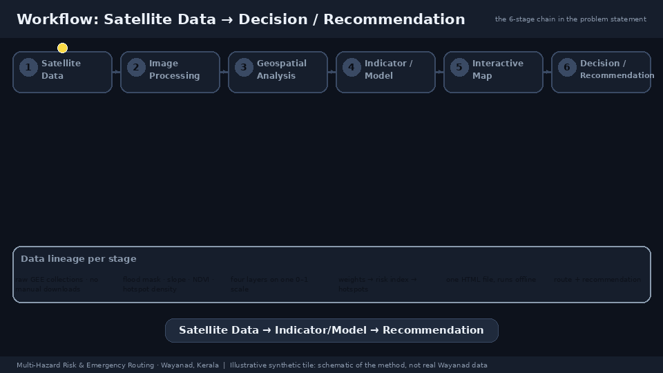

<p><sub><strong>Satellite data → Indicator / Model → Recommendation</strong></sub></p>

</div>

---

## Project at a glance

Wayanad Risk Observatory brings **hazard mapping, exposure analysis and emergency routing** into one geospatial
workflow. It uses Google Earth Engine to analyse satellite observations, combines flood, landslide, fire and
exposure layers with **AHP + entropy weighting**, identifies high-risk hotspots, and compares the **shortest** road
route with the **least-risk** route to a hospital or shelter.

The output is a **standalone interactive analysis map**, accompanied by a **3D terrain viewer** and reusable
GeoTIFF, GeoJSON and CSV artifacts. The project connects scientific analysis to practical questions: where is risk
concentrated, which settlements are exposed, and when does a longer route reduce hazard exposure?

| 🛰️ Observe | 🧮 Understand | 🗺️ Explore | 🚑 Respond |
|:---|:---|:---|:---|
| Sentinel-1/2, SRTM, CHIRPS, JRC, MODIS/VIIRS and Dynamic World | Normalised hazard layers, AHP consistency, entropy weighting and CRITIC comparison | Risk classes, hotspots, terrain, layer controls and point inspection | Five settlement origins, hospital/shelter destinations and dual-route comparisons |

<table>
<tr>
  <td align="center" width="25%"><strong>4</strong><br><sub>Hazard &amp; exposure dimensions</sub></td>
  <td align="center" width="25%"><strong>2,143 km²</strong><br><sub>Wayanad study-area polygon</sub></td>
  <td align="center" width="25%"><strong>351</strong><br><sub>Extracted hotspot polygons</sub></td>
  <td align="center" width="25%"><strong>10</strong><br><sub>Origin–destination comparisons</sub></td>
</tr>
</table>

*Area, hotspot and route counts above describe the saved project outputs; they are not live monitoring metrics.*

## Visual tour

The supplied animations explain the system from first observation to final recommendation. **Their maps and
example numbers are illustrative synthetic demonstrations, not screenshots or measurements of the Wayanad run.**
The [reference results](#results-of-the-reference-run) below report the saved analysis separately.

<table>
<tr>
  <td width="50%" align="center"><strong>Interactive map walkthrough</strong></td>
  <td width="50%" align="center"><strong>Feature atlas</strong></td>
</tr>
<tr>
  <td><a href="hackathon_gifs/gifs/04_dry_run_web_map.gif">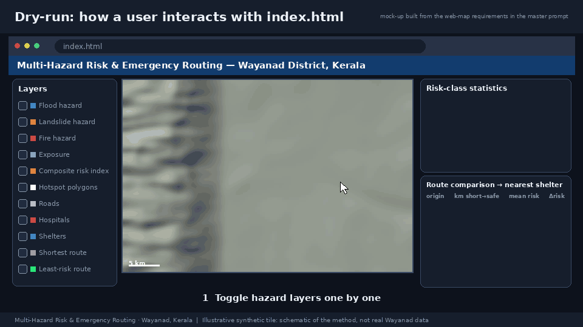</a></td>
  <td><a href="hackathon_gifs/gifs/05_feature_atlas.gif">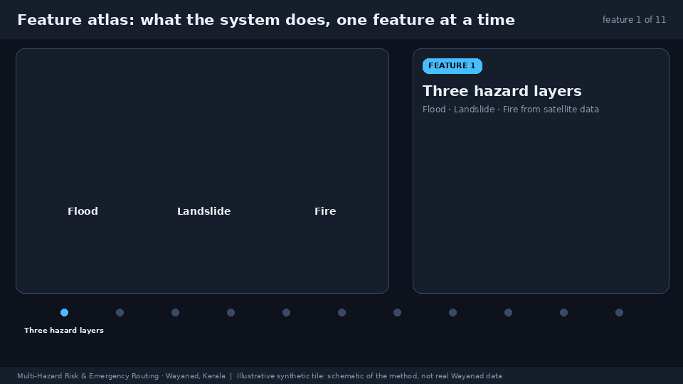</a></td>
</tr>
<tr>
  <td align="center"><sub>Layers, hotspots, points of interest and route comparison.</sub></td>
  <td align="center"><sub>A visual guide to the capabilities of the decision-support system.</sub></td>
</tr>
</table>

<details>
<summary><strong>▶ Watch the full hazard-to-decision story</strong></summary>

<p align="center">
  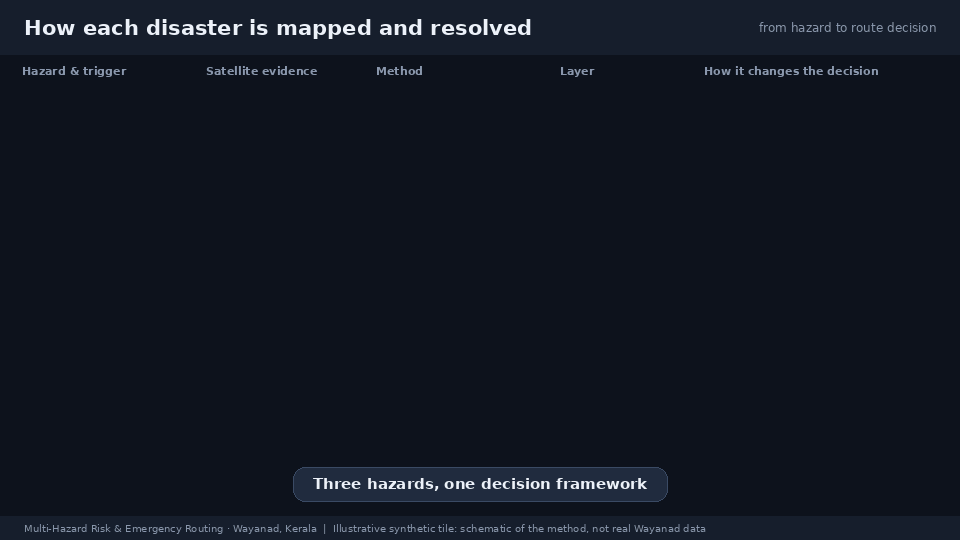
</p>

</details>

---

## Which `index.html` is which?

There are two web pages in this repository. They are different things:

| File | What it is | How to open |
|---|---|---|
| **[`index.html`](index.html)** (project root, ~26 MB) | **The pipeline's deliverable.** The Folium/Leaflet map generated by `python -m src.webmap`: all rasters, hotspots, **every road and 2,500+ facilities/places with an on/off master switch**, a **two-place route search** that lists what lies between them, both route types, click-anywhere popups, legend, statistics and route-comparison tables. Built from real analysis output. | `http://localhost:8000/index.html` (see [Run it on localhost](#run-it-on-localhost)) |
| **[`frontend/index.html`](frontend/index.html)** | A separate **3D "Wayanad Risk Observatory" viewer** (orbitable terrain with real SRTM relief and Sentinel-2 imagery, the saved risk grids, hotspots, real routes and statistics). It reads the pipeline's saved outputs and **embeds the root map in its "Detailed map" tab**, so both live in one site. See [3D frontend](#3d-frontend). | `http://localhost:8000/frontend/index.html` |

For the full analysis layers and tables, start with **root `index.html`**. For terrain exploration and focused route
comparisons, open **`frontend/index.html`**.

## Contents

* [Project at a glance](#project-at-a-glance) · [Visual tour](#visual-tour)

1. [Run it on localhost](#run-it-on-localhost)
2. [Results of the reference run](#results-of-the-reference-run)
3. [Why Wayanad](#why-wayanad)
4. [Setup and running the pipeline](#setup-and-running-the-pipeline)
5. [Repository layout](#repository-layout)
6. [How it works](#how-it-works)
7. [Outputs](#outputs)
8. [Configuration reference](#configuration-reference)
9. [Robustness, caching and resuming](#robustness-caching-and-resuming)
10. [Testing](#testing)
11. [Limitations and honest notes](#limitations-and-honest-notes)
12. [Troubleshooting](#troubleshooting)
13. [3D frontend](#3d-frontend)
14. [Methods & References](#methods--references)

---

## Run it on localhost

The map is a static file, so any local web server works. From the project folder:

```powershell
# Windows PowerShell (or any shell with Python 3)
cd multi-hazard-risk-system
python -m http.server 8000
```

Then open:

* **Real analysis map:** <http://localhost:8000/index.html>
* 3D viewer: <http://localhost:8000/frontend/index.html>

Stop the server with `Ctrl+C`. Notes:

* Double-clicking `index.html` also works (it is self-contained), but a local server avoids browser restrictions on
  `file://` pages and is the recommended way.
* The map needs an internet connection for the **Leaflet/Bootstrap/Font Awesome scripts and the basemap tiles**
  (OpenStreetMap, Carto, Esri). All analysis data (rasters, polygons, routes, tables) is embedded in the file itself,
  so nothing depends on Earth Engine tokens that expire.
* The file is ~26 MB because it embeds five raster overlays plus per-pixel look-up arrays for the click popups; it
  typically opens within a few seconds on a desktop browser.
* Port 8000 busy? Use another: `python -m http.server 8080`.

## Results of the reference run

Saved Wayanad analysis from 1 October 2026. `run8.log` records a completed pipeline; the routing table below reflects
the current saved route outputs, which supersede the earlier destinations and metrics printed in that log.

> **A concrete route trade-off:** Panamaram → District Hospital Mananthavady reduces mean modelled risk by
> **18.44%** for **5.37%** more distance. The verified 2024 landslide zone passes the model check, with
> **68.11%** of zone pixels classified High or Very High.

| Item | Result |
|---|---|
| Study area | 2,143 km² (OSM district polygon); classified area 2,130 km² |
| Analysis grid | 30 m (UTM 43N) for computation; 100 m (747 × 588 px, lon/lat) for export, routing and the map |
| Sentinel-1 flood windows | Aug 2018 (3 scenes), Aug 2019 (1 scene), Jul–Aug 2024 (2 scenes); Otsu thresholds −13.0 / −13.1 / −13.3 dB |
| Sentinel-2 NDVI | 90 scenes, 2023-11-01 → 2024-04-30 (ends before the July 2024 event) |
| Fire detections | 1,504 MODIS (FIRMS) + 1,510 VIIRS (VNP14A1) daily images, Jan–May, 2015-12-31 → 2025-12-31 |
| Road network | 187,194 nodes, 379,258 directed edges (largest strongly connected component) |
| **AHP consistency ratio** | **0.019** (limit 0.1) |
| **Landslide validation** (published event location) | **PASS** — see below |
| Hotspots | 351 polygons, 402 km² (18.8 % of area), largest 131 km², 53.6 km² of built-up land inside |
| Routes | 10 origin–destination pairs (5 settlements × nearest major hospital and shelter) |

### MCDM weights

| Criterion | AHP target | AHP (eigenvector) | Entropy | **Combined (used)** | CRITIC |
|---|---|---|---|---|---|
| Flood | 0.35 | 0.346 | 0.763 | **0.554** | 0.162 |
| Landslide | 0.30 | 0.305 | 0.006 | **0.155** | 0.173 |
| Exposure | 0.20 | 0.199 | 0.056 | **0.128** | 0.340 |
| Fire | 0.15 | 0.150 | 0.175 | **0.162** | 0.326 |

AHP: λ<sub>max</sub> = 4.0518, CI = 0.0173, **CR = 0.0192**.

### Risk classes (quantile breaks 0.192 / 0.223 / 0.246 / 0.293)

| Class | Index range | Area km² | % of area |
|---|---|---|---|
| Very Low | 0.000–0.192 | 425.2 | 20.0 |
| Low | 0.192–0.223 | 486.0 | 22.8 |
| Moderate | 0.223–0.246 | 332.5 | 15.6 |
| High | 0.246–0.293 | 454.6 | 21.4 |
| Very High | 0.293–1.000 | 431.4 | 20.3 |

### Landslide validation gate — July 2024 Mundakkai–Chooralmala

The question: does the susceptibility model, built from satellite data that all pre-date the event, classify the
documented disaster zone as **High or Very High**?

| Test point | Result |
|---|---|
| **Published event location** (11.486 °N, 76.156 °E), 2 km zone | **PASS** — point class *High*; modal zone class *Very High*; **68 %** of zone pixels High/Very High (Very High 45.8 %, High 22.3 %, Moderate 22.8 %, Low 1.1 %, Very Low 8.1 %); zone mean LSI 0.621 |
| Coordinate in the project brief (11.49 °N, 76.23 °E) | **N/A** — the point (and its 2 km buffer) lies **outside Wayanad district**, so no zone could be tested |

The brief's longitude of 76.23 °E is ~8 km east of where published event records (landslides.org; NRSC Charter 1029
products) place the slide, and falls outside the district polygon. The code tests **both** points
(`EVENT_POINT_VERIFIED`, `EVENT_POINT_SPEC`), reports N/A when a zone is outside the study area rather than crashing,
and uses the verified location as the headline gate. **PASS** requires the modal class ≥ High **and** ≥ 50 % of zone
pixels in High/Very High (`VALIDATION_MIN_FRACTION`).

### Emergency routes (α = 3.0)

Origins are the five highest-mean-risk settlement clusters (from 46 candidates found with Dynamic World built area):
Kallumukku (mean risk 0.377), Padinjarethara (0.349), Panamaram (0.342), Vellmunda (0.332), Korome (0.327).

| Origin → destination | Shortest km | Least-risk km | Δ distance | Mean risk (short → safe) | Δ mean risk |
|---|---|---|---|---|---|
| Kallumukku → Government Taluk Hospital | 9.28 | 9.28 | 0 % | 0.335 → 0.335 | 0 % |
| Kallumukku → Govt HSS Kalloor (shelter) | 0.40 | 0.40 | 0 % | 0.379 → 0.379 | 0 % |
| Padinjarethara → K J Medical Trust Hospital | 18.45 | 18.45 | 0 % | 0.274 → 0.274 | 0 % |
| Padinjarethara → Panchayat Auditorium (shelter) | 1.34 | 1.34 | 0 % | 0.332 → 0.332 | 0 % |
| **Panamaram → District Hospital Mananthavady** | **14.11** | **14.87** | **+5.4 %** | **0.368 → 0.300** | **−18.4 %** |
| Panamaram → Crescent Public High School (shelter) | 0.44 | 0.44 | 0 % | 0.308 → 0.308 | 0 % |
| Vellmunda → District Hospital Mananthavady | 12.28 | 12.28 | 0 % | 0.287 → 0.287 | 0 % |
| Vellmunda → St Anne's Public School (shelter) | 1.27 | 1.27 | 0 % | 0.340 → 0.340 | 0 % |
| Korome → District Hospital Mananthavady | 17.25 | 17.25 | 0 % | 0.292 → 0.292 | 0 % |
| Korome → MTDM HSS Thondernadu (shelter) | 1.43 | 1.43 | 0 % | 0.308 → 0.308 | 0 % |

For Panamaram → District Hospital the least-risk route also cuts cumulative exposure (Σ length × risk) by 14.1 %.
Full metrics (including max risk per route): `outputs/route_metrics.csv`.

### Reading the results honestly

* **Entropy pulls the combined weights strongly towards flood.** The flood layer is spatially sparse (valley bottoms
  only), and entropy treats a concentrated layer as very informative, so the combined weights (flood 0.55,
  landslide 0.16) differ a lot from the terrain-justified AHP weights (0.35 / 0.30). This is a known behaviour of the
  method, not a bug; CRITIC disagrees yet again (it favours exposure and fire). If you prefer the terrain-justified
  priorities, give AHP more weight in `mcdm.combine_weights`. The landslide layer is validated independently (above),
  regardless of its weight in the composite.
* **Most routes coincide.** Wayanad's mountain road network offers few alternatives; for 9 of 10 pairs the least-risk and
  shortest routes are the same road. Shelter trips are short (0.4–1.4 km) because large schools and community halls are
  dense inside settlements. The one pair with a genuine alternative shows the intended trade-off.
* **The quantile classes are relative.** "Very High" is by construction the top 20 % of the district, so the class
  statistics describe *relative* risk, not absolute probability.

## Why Wayanad

Wayanad is a high-relief Western Ghats plateau and one of India's most multi-hazard-dense districts.

<table>
<tr>
  <td width="50%" align="center"><strong>Seasonal hazard context</strong></td>
  <td width="50%" align="center"><strong>Why radar matters in the monsoon</strong></td>
</tr>
<tr>
  <td>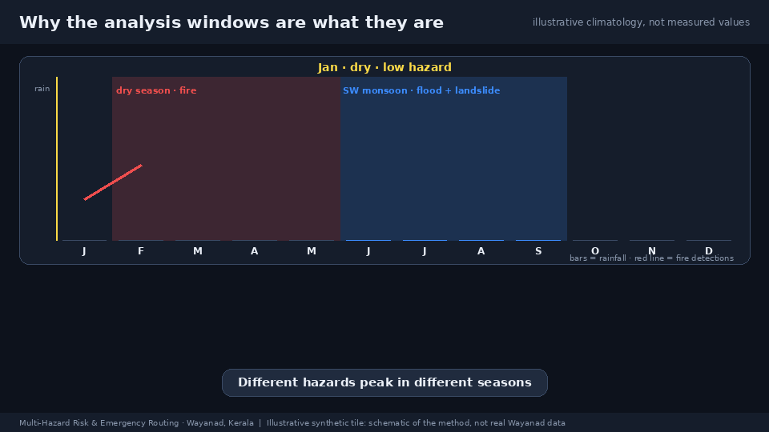</td>
  <td>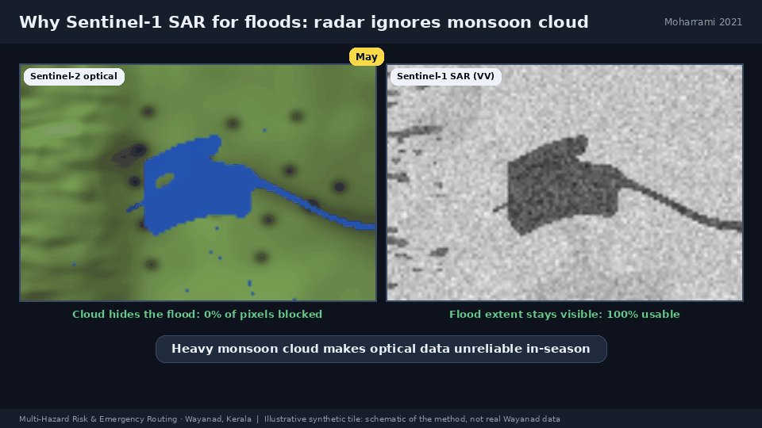</td>
</tr>
</table>

| Hazard | Context | Layer |
|---|---|---|
| **Landslide** (dominant) | July 2024 Mundakkai–Chooralmala disaster; 2019 slides; slopes often > 30°, deep weathered soil, extreme monsoon rainfall | SRTM slope/elevation + NDVI + CHIRPS monsoon max, Frequency-Ratio ratings |
| **Flood** | 2018 and 2019 Kerala floods; settlements in Kabini-tributary valley bottoms | Sentinel-1 SAR, Otsu threshold |
| **Fire** | Recurrent Feb–May forest fires in deciduous tracts and sanctuaries | 10-year MODIS/VIIRS active-fire density × fuel cover |
| **Exposure** | Settlements and plantations creeping onto mid-slope / escarpment-foot zones | Dynamic World built area + road proximity |

**Design rationale for SAR.** The southwest monsoon (Jun–Sep) keeps Wayanad under heavy cloud exactly when floods
occur, so optical sensors are unreliable in-season. Sentinel-1 C-band radar sees through cloud, and open water gives
very low VV backscatter — hence the flood layer is SAR-based. Optical data (Sentinel-2 NDVI, Dynamic World) is used only
from cloud-free dry-season windows that **end before the July 2024 event**, so the landslide validation is free of label
leakage (no landslide scars in the inputs).

## Setup and running the pipeline

### Prerequisites

* Python 3.11+ (developed on 3.14)
* A Google account with Earth Engine access and a **Google Cloud project registered for Earth Engine**
  (<https://code.earthengine.google.com/register>)
* Internet access (Earth Engine, OSM extract download, basemap tiles)

### Install

```bash
git clone <this repo> && cd multi-hazard-risk-system
python -m venv .venv
source .venv/bin/activate            # Windows: .venv\Scripts\activate
pip install -r requirements.txt
```

### Authenticate Earth Engine (one time) and select your project

```bash
earthengine authenticate             # or: python -c "import ee; ee.Authenticate()"
export GEE_PROJECT=your-cloud-project-id          # PowerShell: $env:GEE_PROJECT = "your-cloud-project-id"
```

If authentication or the project is missing, the program prints these steps and exits cleanly (exit code 2); it never
crashes silently.

### Run

```bash
python -m src.webmap                 # full pipeline  →  index.html
```

A full first run takes roughly **25–30 minutes**, almost all of it Earth Engine computation (NDVI median over 90 scenes,
10 years of fire data, class statistics). The log prints each stage: layers computed, validation gate with PASS/FAIL,
weight table, CR, class statistics, rasters exported, hotspots, origins, every route, and an acceptance summary.

| Command | Effect |
|---|---|
| `python -m src.webmap` | Full pipeline |
| `python -m src.webmap --resume` | Re-run after a late failure: reuses the MCDM checkpoint, the saved validation result and any raster bands already downloaded |
| `python -m src.webmap --from-cache` | Rebuild hotspots, routes and the map from `outputs/` **without Earth Engine** (useful after changing routing or map settings) |
| `python -m src.webmap --live-tiles` | Additionally add live Earth Engine tile layers (their tokens expire after ~1 day) |
| `python -m pytest tests -q` | Offline unit tests |
| `jupyter notebook demo.ipynb` | Same pipeline step by step, plus a geemap explorer |

### Where the OSM data comes from

By default (`config.OSM_SOURCE = "pbf"`) the road network and points of interest are built from the ~180 MB **Kerala
OpenStreetMap extract** (download.openstreetmap.fr), downloaded once into `outputs/cache/kerala.osm.pbf`. This is fast,
reproducible and works behind firewalls that block the Overpass API. Set `OSM_SOURCE = "overpass"` to use live Overpass
queries via OSMnx instead; whichever source is not selected is tried automatically if the chosen one fails.

## Repository layout

```
multi-hazard-risk-system/
├── README.md
├── requirements.txt
├── config.py                  # ALL tunables: area, dates, factor ratings, weights, alpha, thresholds, paths
├── index.html                 # standalone interactive web map (pipeline deliverable)
├── demo.ipynb                 # end-to-end notebook
├── src/
│   ├── gee_init.py            # Earth Engine auth/init with fix-it messages; study area from OSM (bbox fallback)
│   ├── utils.py               # logging, winsorised min-max normalisation, FR class rating, Dynamic World composite
│   ├── hazard_flood.py        # Sentinel-1 VV → Otsu → JRC + slope masks → flood frequency → 0–1
│   ├── hazard_landslide.py    # slope/elevation/NDVI/rainfall FR ratings → 0–1; July-2024 validation gate
│   ├── hazard_fire.py         # MODIS/VIIRS counts → Gaussian KDE × Dynamic World fuel cover → 0–1
│   ├── exposure.py            # Dynamic World built area + OSM road proximity → 0–1
│   ├── mcdm.py                # AHP (CR asserted), entropy, CRITIC, weighted overlay, reclassification, statistics
│   ├── rasters.py             # Earth Engine → NumPy export on one grid (+ GeoTIFFs), resumable
│   ├── hotspots.py            # Very High class → polygons with area / risk / built-up statistics
│   ├── osm_pbf.py             # OSM drive network + POIs from a regional PBF extract (Overpass-free)
│   ├── routing.py             # edge risk sampling, settlement origins, dual Dijkstra, route metrics
│   ├── webdata.py             # compact road graph + facility payloads embedded in the map
│   ├── static/search.js       # in-browser facilities layer, master switch, two-place route search
│   ├── webmap.py              # Folium/Leaflet standalone map + CLI entry point
│   └── pipeline.py            # orchestration + acceptance self-check
├── tests/                     # offline unit tests + synthetic fixtures
├── outputs/                   # rasters, statistics CSVs, GeoJSON, summary, caches
├── frontend/                  # geographic 3D viewer, terrain assets and data export
├── hackathon_gifs/gifs/        # 18 animated explainers used in this README
└── docs/                      # frontend plan and previews
```

## How it works

<p align="center">
  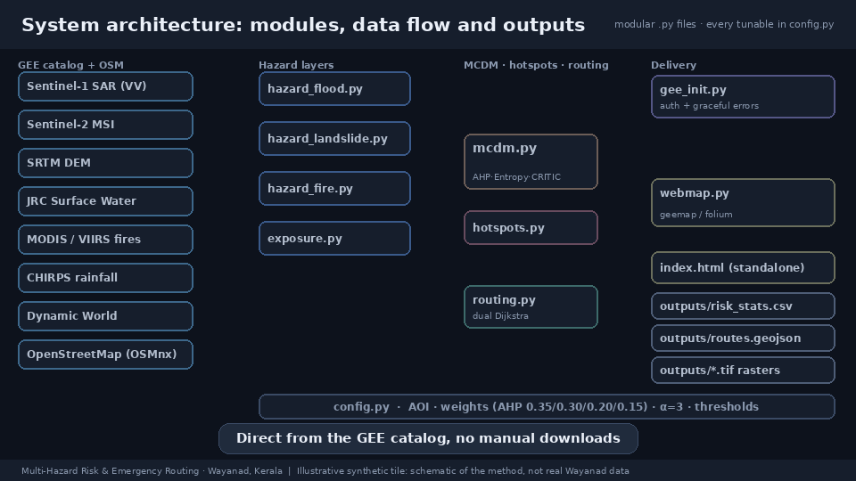
</p>

**One pipeline, two ways to explore the result.** Earth Engine provides the raster analysis; Python combines the
layers and computes routes; Folium delivers the analytical map; the separate Canvas viewer provides geographic
terrain exploration.

### 1. Study area (`gee_init.py`)

The AOI is the OSM administrative polygon of "Wayanad district, Kerala, India" (Nominatim via OSMnx, cached to
`outputs/cache/aoi.geojson`), simplified to ~100 m before being sent to Earth Engine. If geocoding fails the fallback
bounding box (lon 75.75–76.55, lat 11.45–12.05) is used. All analysis runs on a fixed **UTM 43N, 30 m** grid
(`finalize_layer`), so every statistic and map is scale-consistent.

### 2. Flood hazard (`hazard_flood.py`)

<p align="center">
  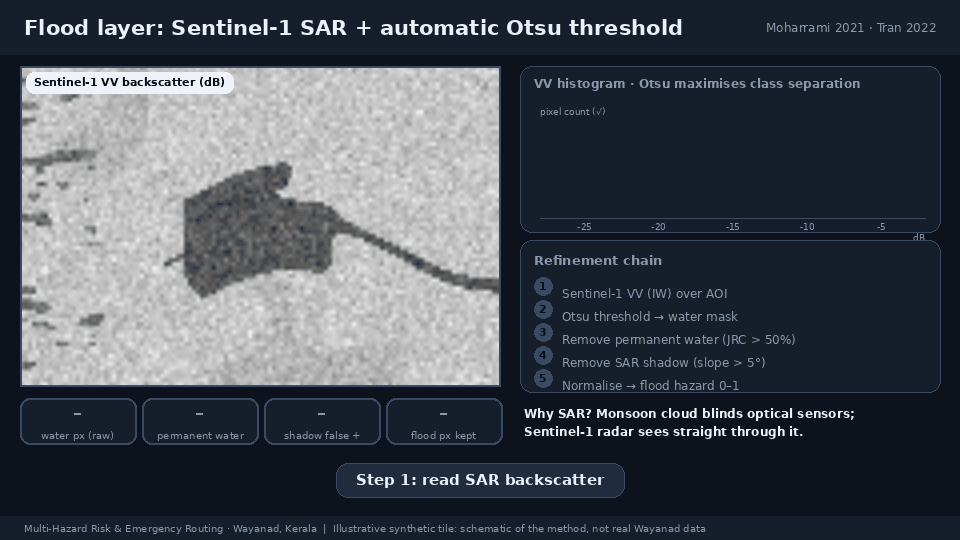
</p>

1. For each flood window (Aug 2018, Aug 2019, Jul–Aug 2024) build a **median VV (dB) composite** of Sentinel-1 IW scenes
   and apply a 30 m focal-median speckle filter.
2. Derive an **automatic Otsu threshold** (maximising between-class variance of the VV histogram). Because Wayanad is
   mostly land, a histogram over the whole district is dominated by vegetation and Otsu splits the wrong modes (first
   attempt: −9 dB). The histogram is therefore built only from the **low-slope (≤ 5°) neighbourhood (1 km) of known
   surface water** (JRC occurrence > 5 %), which keeps it bimodal. The result is guard-railed to −22…−13 dB; the
   unconstrained 2018 value (−12.1 dB) was clamped to −13 dB.
3. `water = VV < threshold`, then **remove permanent water** (JRC occurrence > 50 %) and **slope > 5°** (radar-shadow
   false positives). Empty windows are skipped, never fatal.
4. **Flood frequency** = mean of the window masks; smoothed with a 90 m focal mean and blended **70/30** with JRC
   non-permanent occurrence (historical water exposure); winsorised min-max → 0–1.

### 3. Landslide susceptibility (`hazard_landslide.py`)

<p align="center">
  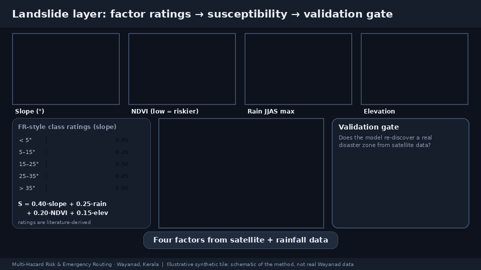
</p>

A Frequency-Ratio-style model: each conditioning factor is rated with literature-derived FR class values
(FR > 1 = more landslide-prone than average) and combined with FR-AHP factor weights:

```
LSI = Σ_f  w_f × FR_f(class of factor f)         then min-max → 0–1
```

| Factor | Source | Class edges | FR ratings (class 1 → n) | Weight |
|---|---|---|---|---|
| Slope (°) | SRTM | 5, 15, 25, 35, 45 | 0.15, 0.50, 1.10, 1.90, 2.40, 1.80 | 0.40 |
| Rainfall (mm) | CHIRPS: max over 2010–2023 of the Jun–Sep seasonal total | 2000, 2500, 3000, 3500 | 0.50, 0.90, 1.30, 1.70, 2.10 | 0.25 |
| NDVI | Sentinel-2, dry-season median, cloud-masked (SCL), gaps filled | 0.2, 0.4, 0.6, 0.8 | 2.00, 1.60, 1.10, 0.80, 0.50 | 0.20 |
| Elevation (m) | SRTM | 300, 700, 1100, 1500, 2000 | 0.30, 0.80, 1.40, 1.70, 1.20, 0.60 | 0.15 |

All values and edges live in `config.LANDSLIDE_FACTORS` / `LANDSLIDE_FACTOR_WEIGHTS`. Optical inputs end before the July
2024 event (no leakage). **Validation** (`validate_event_zone`): quantile-classify the LSI, then test the 2 km zone
around each event point; prints PASS/FAIL with the sampled class shares. On FAIL it names the dominating factor
(largest mean weighted contribution in the zone) and the factor with the lowest zone/district ratio, and suggests one
concrete calibration change (move 0.05 of weight from the weak factor to the dominating one, or raise that factor's FR
ratings). The result is saved to `outputs/landslide_validation.json`.

### 4. Fire hazard (`hazard_fire.py`)

<p align="center">
  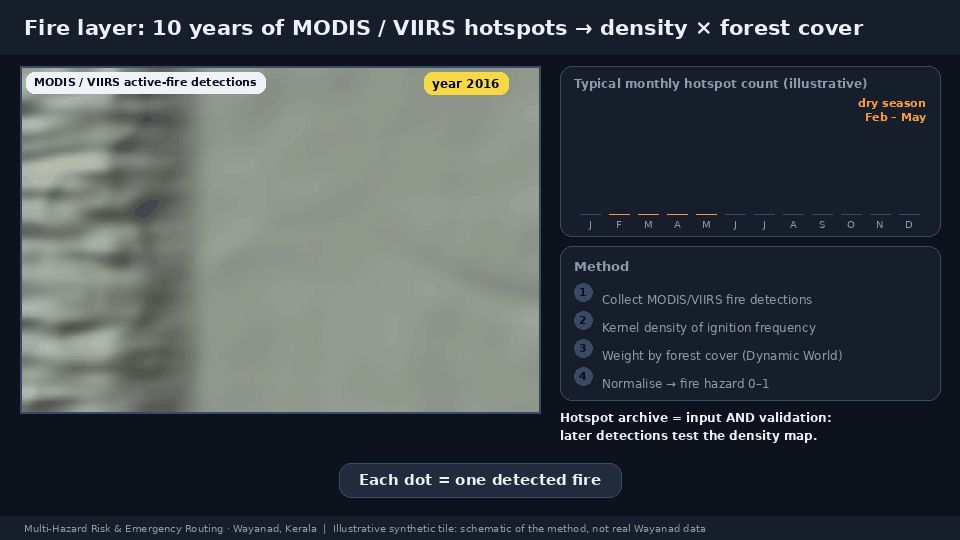
</p>

1. Count dry-season (Jan–May) active-fire detections over the last 10 years: **MODIS** (`FIRMS`, confidence ≥ 30 %) and
   **VIIRS** (`NASA/VIIRS/002/VNP14A1`, FireMask ≥ 7).
2. Each daily image is clipped to the region **before** summing (reprojecting an unbounded sinusoidal-grid image to UTM
   fails in Earth Engine with "Can't transform (0.0,0.0)").
3. **Gaussian kernel density** (radius 5 km, σ = 2.5 km) on the 1 km native grid, resampled bilinearly.
4. Weight by **fuel availability** = Dynamic World probability of trees + grass + shrub + crops, with a floor of 0.20 so
   density is never zeroed by sparse fuel: `fire = density_n × (0.2 + 0.8 × fuel)`; winsorised min-max → 0–1.

### 5. Exposure (`exposure.py`)

`exposure = 0.70 × smooth(Dynamic World built probability) + 0.30 × road proximity`, with proximity
`= 1 − min(d, 1500 m) / 1500 m` and `d` the distance to the nearest OSM road. OSM roads (all classes from motorway to
residential) are de-duplicated (one entry per undirected road), merged into polylines, simplified (25 m, doubling up to
5 times; the least important class is dropped if the 60,000-vertex request cap is still exceeded) and uploaded to
Earth Engine as a `FeatureCollection`. The upload is bounded: in the reference run 17,535 polylines / 52,171 vertices kept
all classes.

### 6. Normalisation (`utils.py`)

<details>
<summary><strong>▶ See how different indicators become comparable</strong></summary>

<p align="center">
  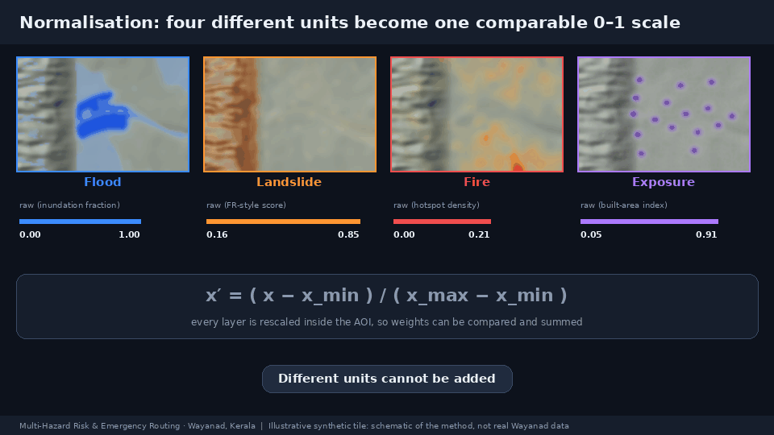
</p>

</details>

Every layer is min-max rescaled to 0–1 inside the study area, with the **upper bound at the 99th percentile**
(`NORMALIZE_UPPER_PERCENTILE`; values above are clamped to 1; set `None` for strict min-max). Without this, a handful
of extreme pixels squash a sparse layer towards zero and distort the entropy weights. A degenerate (constant) layer
becomes all zeros instead of dividing by zero.

### 7. MCDM and composite risk (`mcdm.py`)

<p align="center">
  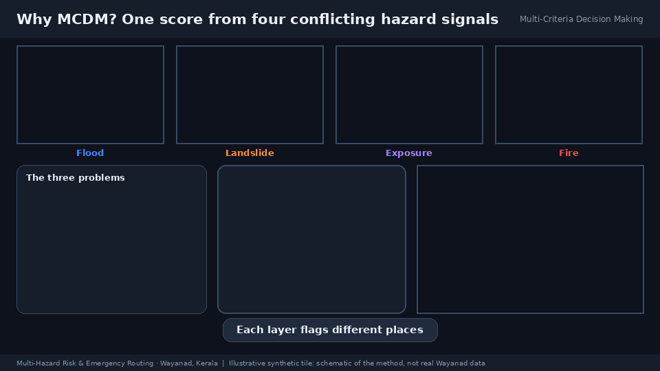
</p>

<details>
<summary><strong>▶ Explore the weighting methods and sensitivity comparison</strong></summary>

#### Expert priorities: AHP and consistency

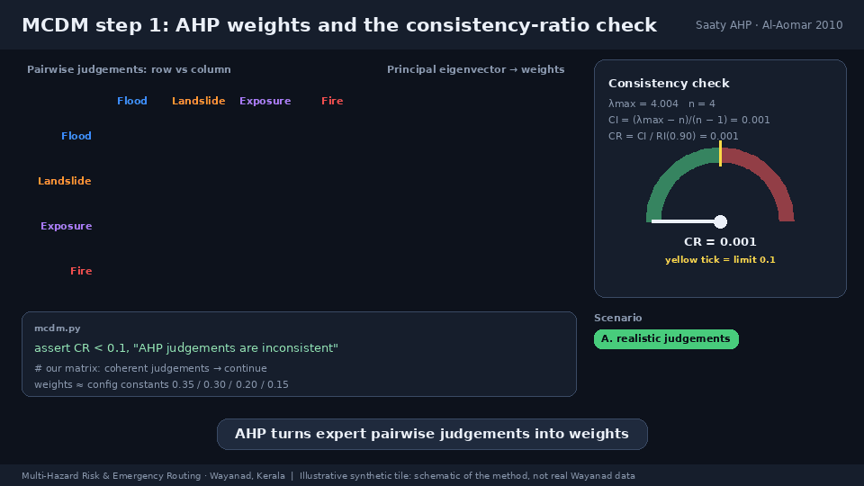

#### Data-driven information: entropy, CRITIC and combined weights

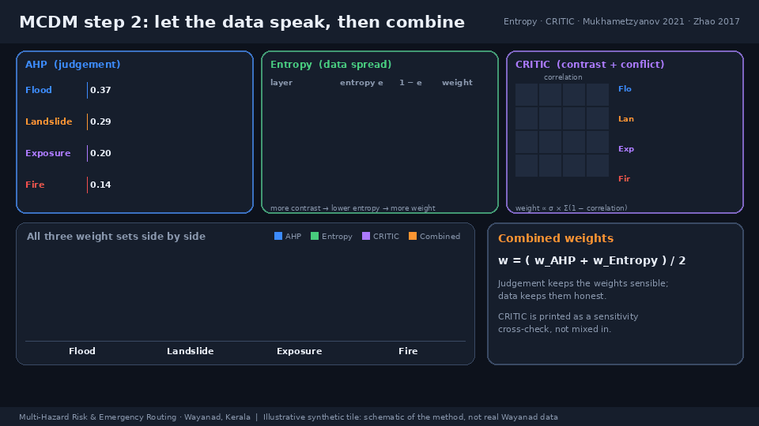

#### Sensitivity: how weighting changes the interpretation

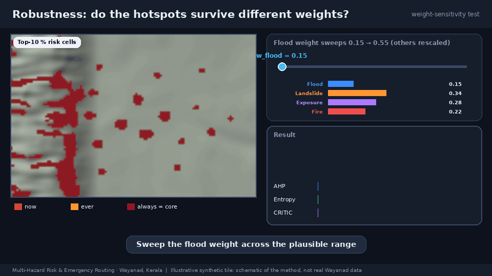

The pipeline computes CRITIC as a comparison; the saved composite uses combined AHP + entropy weights.

</details>

* **AHP.** A Saaty pairwise matrix (order flood, landslide, exposure, fire) calibrated so its principal eigenvector
  reproduces the target weights 0.35 / 0.30 / 0.20 / 0.15 to ±0.005:
  ```
  [[1,    1.5,  1.5,  2  ],
   [1/1.5, 1,   2,    2  ],
   [1/1.5, 1/2, 1,    1.5],
   [1/2,  1/2, 1/1.5, 1  ]]
  ```
  `CI = (λmax − n)/(n − 1)`, `CR = CI / RI` (RI = 0.90 for n = 4); the code **asserts CR < 0.1**.
* **Entropy.** From 20,248 randomly sampled pixels: `p_ij = x_ij / Σ x_ij`, `e_j = −Σ p ln p / ln n`,
  `w_j = (1 − e_j) / Σ(1 − e_j)`.
* **CRITIC** (sensitivity only): `C_j = σ_j Σ_k (1 − r_jk)`, normalised.
* **Combined weights** = mean(AHP, entropy). All three sets print side by side and are saved to `outputs/mcdm_weights.csv`.
* **Composite** = Σ w_c × layer_c, min-max rescaled to the full 0–1 range. It is computed in Earth Engine for the
  statistics and **client-side from the exported layers** for the map and routing (a linear map, so identical; avoids
  exporting Earth Engine's deepest computation graph).
* **Classes.** 5 classes (Very Low → Very High) by quantiles (default) or Fisher–Jenks natural breaks
  (`RISK_CLASSIFICATION = "natural_breaks"`); area (km²) and % per class are written to `outputs/risk_stats.csv`.

### 8. Hotspots (`hotspots.py`)

<p align="center">
  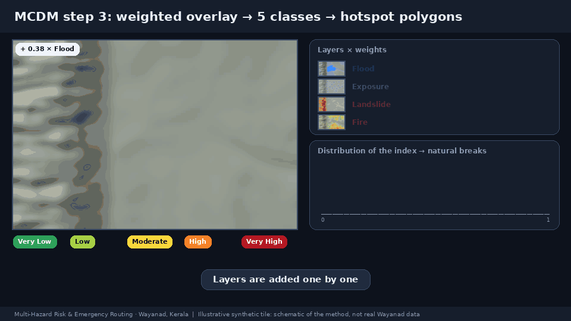
</p>

The Very High class raster is vectorised (8-connected), fragments below 0.05 km² are dropped, polygons are simplified,
and each polygon gets area (km², computed in UTM), mean/max composite risk and the built-up area inside it
(`outputs/hotspots.geojson`).

### 9. Least-risk emergency routing (`routing.py`)

<p align="center">
  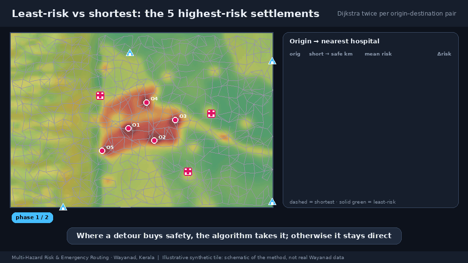
</p>

<details>
<summary><strong>▶ See how the risk index becomes a road-edge cost</strong></summary>

<p align="center">
  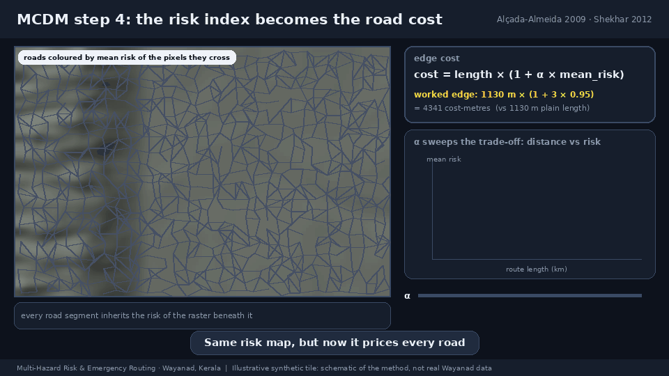
</p>

</details>

* **Graph.** Directed drive network (`osm_pbf.py` or OSMnx), largest strongly connected component.
* **Edge risk.** The composite raster is sampled at points every 50 m along each edge: `risk` = mean, `risk_max` = max;
  edges entirely outside the raster take the raster mean (9,688 of 379,258 in the reference run).
* **Edge cost.** `risk_cost = length × (1 + α × mean_risk)`, α = 3.0 (`ROUTE_ALPHA`).
* **Origins.** Dynamic World built-area pixels (smoothed probability ≥ 0.5, lowered stepwise if too few clusters) are
  dilated 2 px and labelled into **settlement clusters**; clusters ≥ 15 px are ranked by mean composite risk, and the
  top 5 that are ≥ 3 km apart become origins. Each origin is snapped to the nearest graph node and named from the
  nearest OSM `place` (within 4 km).
* **Destinations.**
  * *Hospitals:* OSM `amenity=hospital` / `healthcare=hospital` that are tagged `emergency=yes` or whose name matches
    taluk / district / general hospital / medical college / medical centre|institute|trust / government hospital, etc.
    (`HOSPITAL_MAJOR_REGEX`), excluding mis-tagged dental clinics, pharmacies, labs, Ayurvedic/Homoeo units, PHCs and
    veterinary hospitals. 12 of 168 hospitals qualified; if fewer than 5 qualify, all hospitals are used.
  * *Shelters:* community centres, `emergency=assembly_point|shelter`, `amenity=shelter` that are **not** bus/transport
    shelters, and **large schools** (name matches higher secondary / high school / college / public school …) — in Kerala
    most relief camps are schools. 180 qualified. Without these filters 867 "shelters" (mostly bus shelters and every
    primary school) made every route trivially short.
* **Dijkstra twice per pair.** The nearest destination (by network length) is chosen once; the **shortest** route
  (weight = length) and the **least-risk** route (weight = `risk_cost`) are both computed to that destination and
  compared on distance, length-weighted mean risk, max risk, cumulative exposure (Σ length × risk), % risk reduction and
  % distance increase.

### 10. Web map (`webmap.py`)

Folium/Leaflet. Rasters are colour-mapped to PNG overlays and embedded; the same rasters are embedded as quantised byte
arrays so a click anywhere returns the **risk class, composite index and each layer's value at that pixel**.

* Layer panel with toggles and **opacity sliders**: composite risk (green → yellow → orange → red → dark red), flood,
  landslide, fire, exposure, hotspots, major roads (coloured by risk), hospitals, shelters, origin settlements, shortest
  route (dashed grey), least-risk route (solid green), and the July 2024 event markers with the 2 km zone.
* **Facilities & roads switch and two-place search** (see section 12).
* Legend, scale bar, basemap switcher (OSM / light / Esri satellite), risk-class statistics table, hotspot summary,
  **route-comparison table** (distance vs risk reduction), landslide validation result, MCDM weights with the CR.
* Professional header: "Multi-Hazard Risk & Emergency Routing — Wayanad District, Kerala".

### 11. Raster export (`rasters.py`)

Layers are averaged from 30 m to a 100 m EPSG:4326 grid (`reduceResolution(mean)`) and downloaded **one band per
request** straight from Earth Engine (`getDownloadURL`; no manual downloads), each cached in `outputs/rasters/_bands/`.
A band named `inside` (1 inside the AOI) preserves the AOI mask because Earth Engine writes masked pixels as 0.

### 12. Facilities, roads and the two-place search (`webdata.py`, `static/search.js`)

The map can show far more than the hospitals and shelters used for routing:

* **Master switch.** *Facilities & roads (details)* in the right panel turns **everything on or off in one click**
  (on by default): all facilities and important places plus the full road network. Underneath, one checkbox per category
  (with counts), an *All roads* checkbox and *All categories / None* buttons.
* **Facilities** come from the Kerala OSM extract (`osm_pbf.scan_facilities`, cached in `outputs/cache/facilities.json`),
  defined in `config.FACILITY_CATEGORIES` — 2,578 features in the reference run:

  | Category | Count | Category | Count |
  |---|---|---|---|
  | Hospitals, clinics & pharmacies | 360 | Banks & ATMs | 154 |
  | Police, fire & emergency | 29 | Fuel stations | 47 |
  | Shelters & community centres | 61 | Bus stations | 23 |
  | Schools & colleges | 487 | Markets & supermarkets | 76 |
  | Government & post offices | 426 | Places of worship | 299 |
  | Tourism & stays | 126 | Towns & villages | 490 |

  Click any marker for its name, category and coordinates. Edit the tag rules, colours and `named_only` flags in `config.py`
  to add or drop categories.
* **Roads.** All drivable roads, coloured by class (major / minor / local), drawn beneath hotspots and routes.
* **Two-place search** (box at the top-left of the map). Type a place, facility or `lat, lon` in **A** and **B**
  (autocomplete over every named feature; or press the ⌖ button and click the map; ⇅ swaps A and B). *Search* then:
  1. snaps both points to the nearest road and runs **Dijkstra twice in your browser** — shortest, and least-risk with
     cost = length × (1 + α × mean risk), α = `config.ROUTE_ALPHA` — and draws both routes (dashed grey / solid green) with
     distance, mean/max risk and the risk-reduction vs distance-increase trade-off;
  2. lists **every facility and important place within 0.5 / 1 / 2 / 5 km of the chosen route**, ordered from A to B with
     the distance along the route and off the route, grouped by category (clickable: zooms to it); only the ticked
     categories are included;
  3. falls back to a straight-line corridor (with a message) if a point is more than 2.5 km from any road or no road
     connection exists.

  Example (reference run): Kalpetta → Mananthavady — shortest 29.1 km (mean risk 0.309), least-risk 29.2 km
  (mean risk 0.267): **−13.7 % mean risk for +0.4 % distance**, with 248 places within 1 km of the route
  (26 hospitals/clinics, 37 schools, 48 government offices, 26 banks, 25 places of worship, …).

How it works without a server: the annotated drive network (edge length and sampled composite risk) is reduced to a
junction-to-junction graph (parallel edges keep the shorter one, degree-2 nodes are contracted, geometry simplified to
~7 m; 187,194 nodes / 379,258 edges → **16,886 junctions / 19,238 segments**, ≈ 1.6 MB as base64 typed arrays) and embedded
in `index.html`. The browser decodes it to CSR adjacency, snaps points to the nearest road vertex, and splits the first and
last road segment so partial segments are costed correctly.

**Limits:** the browser router ignores one-way streets and turn restrictions and uses the static risk raster, so it answers
"which facilities lie along a plausible road route", not turn-by-turn navigation; results depend on OSM tagging and
completeness; place search is limited to named OSM features (use `lat, lon` or the map pins for anything else).

## Outputs

| Output | Description |
|---|---|
| `index.html` | **Standalone interactive map** |
| `outputs/risk_stats.csv` | Area (km²) and % per risk class, with index ranges |
| `outputs/mcdm_weights.csv` | Target AHP, AHP, entropy, combined and CRITIC weights |
| `outputs/landslide_validation.json` | Validation per event point: PASS/FAIL, class shares, factor contributions |
| `outputs/hotspots.geojson` | Very High hotspot polygons (area, mean/max risk, built-up area) |
| `outputs/routes.geojson` | Shortest and least-risk route geometries with distance and risk |
| `outputs/route_metrics.csv` | Per-pair comparison: distances, mean/max risk, reductions |
| `outputs/rasters/*.tif` | `flood`, `landslide`, `exposure`, `fire`, `risk`, `built`, `risk_class` (100 m, EPSG:4326, float32; NaN outside the AOI) |
| `outputs/summary.json` | Everything the map needs (enables `--from-cache`) |
| `outputs/checkpoint_mcdm.json` | Weights, class breaks, class statistics, normalisation bounds (enables `--resume`) |
| `outputs/cache/` | OSM extract, graph (GraphML), POIs, `facilities.json`, AOI polygon (git-ignored) |

## Configuration reference

Everything tunable is in [`config.py`](config.py); no other module hardcodes a value. Highlights:

| Group | Constants |
|---|---|
| Study area | `PLACE_NAME`, `FALLBACK_BBOX`, `ANALYSIS_CRS`, `ANALYSIS_SCALE` (30), `STATS_SCALE` (90), `EXPORT_SCALE` (100) |
| Earth Engine | `GEE_PROJECT` (env `GEE_PROJECT`/`EARTHENGINE_PROJECT`), dataset IDs `DS_*`, `NORMALIZE_UPPER_PERCENTILE` |
| Flood | `FLOOD_EVENT_WINDOWS`, `OTSU_VALID_RANGE_DB`, `OTSU_WATER_ZONE_*`, `FLOOD_MAX_SLOPE_DEG`, `FLOOD_PERMANENT_WATER_OCCURRENCE`, `FLOOD_WEIGHT_SAR/JRC` |
| Landslide | `LANDSLIDE_FACTORS`, `LANDSLIDE_FACTOR_WEIGHTS`, `NDVI_DATE_RANGE`, `RAIN_YEARS`, `EVENT_POINT_*`, `EVENT_BUFFER_M`, `VALIDATION_MIN_FRACTION` |
| Fire | `FIRE_YEARS_BACK`, `FIRE_DRY_SEASON_MONTHS`, `FIRE_MIN_CONFIDENCE`, `USE_VIIRS`, `FIRE_KERNEL_*`, `FIRE_VEG_FLOOR` |
| Exposure | `EXPOSURE_BUILT_WEIGHT`, `EXPOSURE_ROAD_WEIGHT`, `EXPOSURE_ROAD_MAX_DIST_M`, `ROAD_EE_*` |
| MCDM | `AHP_TARGET_WEIGHTS`, `AHP_PAIRWISE`, `AHP_MAX_CR`, `WEIGHT_SAMPLE_PIXELS`, `RISK_CLASSIFICATION`, `RISK_CLASS_*` |
| Routing | `ROUTE_ALPHA`, `N_ORIGINS`, `SETTLEMENT_*`, `HOSPITAL_*`, `SHELTER_*`, `OSM_SOURCE`, `OSM_PBF_URL` |
| Map | `MAP_TITLE`, `MAP_LAYER_OPACITY`, `ROUTE_SHORTEST_STYLE`, `ROUTE_LEASTRISK_STYLE` |

## Robustness, caching and resuming

* **Graceful Earth Engine failures.** `GEEInitError` carries step-by-step fix-it instructions; empty collections are
  detected (`collection_size`) and skipped or reported; every reduction is clipped to the AOI.
* **Resumable.** The MCDM statistics (≈ 7 minutes) are checkpointed; raster bands are cached one file each; the
  validation result is saved. `--resume` skips all of that after a late failure (export, routing, map).
* **Retries.** Raster downloads retry transiently failing requests (e.g. `ConnectionResetError` when Earth Engine holds a
  connection for ~5 minutes) up to 3 times, and surface Earth Engine's own error message on HTTP errors.
* **Bounded loops.** The road upload simplification and settlement-threshold search both terminate by construction.

Problems met and fixed while building the reference run (kept here because they are likely to recur):

| Symptom | Cause | Fix |
|---|---|---|
| Overpass `ConnectionRefused` | Overpass endpoints blocked on this network | Build network/POIs from a regional PBF extract (`osm_pbf.py`) |
| Run silently stalled after "network loaded" | Road-upload simplification looped forever: the PBF graph is unsimplified (two-point segments), so vertices could never drop under the cap | Merge segments into polylines, de-duplicate two-way edges, bound the loops |
| `Can't transform (0.0,0.0)` in the fire layer | Reprojecting an unbounded sinusoidal-grid image to UTM | Clip each daily image to the region before summing |
| Otsu threshold −8 to −9 dB | Histogram dominated by vegetation | Histogram only from the low-slope neighbourhood of known water |
| `reduceResolution … no valid default projection` | Constant `inside` mask image | `setDefaultProjection` before export |
| HTTP 400 exporting the composite risk | Deep Earth Engine graph rejected by the export endpoint | Compute the (linear) composite client-side from the exported layers |
| Entropy weight 0.76 for flood | A few extreme pixels squashed the sparse flood layer | Winsorised (99th percentile) min-max |
| All routes < 5 km and identical | 867 "shelters" (bus shelters, all schools) and 208 "hospitals" (health sub-centres) | Filtered, config-driven destination definitions |

## Testing

```bash
python -m pytest tests -q          # 11 tests, ~20 s, no Earth Engine or internet needed
```

Covers the AHP consistency check (accepts the configured matrix, rejects an inconsistent one), entropy/CRITIC weights,
Fisher–Jenks breaks, Otsu on a synthetic bimodal histogram, hotspot extraction, a routing case in which the least-risk
route detours around a high-risk band (lower mean risk, longer distance), and a full standalone-map build from
synthetic data (including the embedded facilities layer and search UI), the facility payload, and the compact road graph
(degree-2 contraction conserves road length and length-weights risk). The in-browser search was exercised end to end in
headless Edge via the DevTools protocol (autocomplete, `lat, lon` input, same-place, out-of-area, category filter, master
switch, clear). The Earth Engine stages are exercised by running the pipeline.

## Limitations and honest notes

* **FR ratings are literature-derived, not fitted** to a local landslide inventory. The natural next calibration step is
  to fit them to a GSI/KSDMA inventory and evaluate with ROC/AUC. The validation gate is a *necessary* check on one
  event (does the model flag it?), not a full accuracy assessment — and "High/Very High" means the top 40 % of the
  district by landslide index.
* **CHIRPS (~5 km)** is coarse relative to Wayanad's orographic rainfall gradient; **SRTM 30 m** smooths steep escarpments.
* **Flood layer.** Only three windows with 1–3 Sentinel-1 scenes each; a single-image Otsu threshold is data-driven but
  sensitive to the scene. The −13 dB guard rail was hit for 2018. Treat the flood layer as flood *proneness*, not a
  mapped event extent.
* **Entropy weights** reflect layer sparsity as much as information (see the weights discussion above).
* **OSM completeness.** Hospital and shelter coverage depends on OSM tagging; official relief-camp lists are not in OSM.
  Name-based filters (`HOSPITAL_MAJOR_REGEX`, `SCHOOL_SHELTER_REGEX`) are heuristics and English-name biased.
* **Routing.** Risk is static (no live road closures, no travel-time or capacity model); `α = 3` is a policy choice.
  Routes are decision support, not navigation advice.
* **Event coordinates.** See the validation section: the brief's point is outside the district.
* Citation details (volume/pages/DOIs) are given only where certain; verify against the publishers' records before
  formal use.

## Troubleshooting

| Problem | What to do |
|---|---|
| `Earth Engine could not be initialised` | Run `earthengine authenticate`, set `GEE_PROJECT`, make sure the project is registered for Earth Engine |
| `no project found` | `GEE_PROJECT` is not set (see above) |
| Browser shows a blank/grey map | Basemap tiles or Leaflet CDN not reachable (no internet); the data layers are still embedded. Try the `Light basemap` option |
| Marker icons look like empty squares | The icon font CDN did not load (offline/headless); hospitals and shelters are still clickable |
| Too many dots on the map | Untick categories under *Facilities & roads*, or switch the whole detail layer off with the master switch |
| Search says a point is far from any road | The point is >2.5 km from an OSM road (e.g. outside the district); pick a nearer place or use the map pin |
| `ConnectionResetError` during export | Transient; the export retries. Use `--resume` if it ultimately fails |
| Port already in use | `python -m http.server 8080` (any free port) |
| Want to rebuild only the map | `python -m src.webmap --from-cache` (no Earth Engine needed) |
| Overpass is blocked | Keep `OSM_SOURCE = "pbf"` (default) |

## 3D frontend

[`frontend/`](frontend/) contains a separate, self-contained **3D viewer** ("Wayanad Risk Observatory") built with plain
HTML/CSS/JavaScript (Canvas, no build tools, no API keys). Open it at <http://localhost:8000/frontend/index.html> (with the
server from [Run it on localhost](#run-it-on-localhost)) or run `python -m http.server 8080 --directory frontend` →
<http://localhost:8080>. It works offline.

It renders **real data from this pipeline**: SRTM elevation, a Sentinel-2 dry-season RGB composite, the saved 100 m
risk/flood/landslide/fire/exposure grids, hotspot polygons, OSM hospitals/shelters/places, and the saved shortest vs
least-risk routes with their metrics. Click any point for the saved raster value and elevation; switch layers, 3D/2D,
vertical exaggeration, opacity, hotspots and satellite imagery; use the *Emergency routes* tab to compare routes per
settlement and destination type. The display mesh is reduced for interactive rendering, and the browser bundle
quantises hazard indices to 254 levels (approximately ±0.002 display precision). Composite class labels come from
the original saved class raster. Routes are saved model outputs, not live road conditions.

The header's **Detailed map** tab embeds the root `index.html` (the 2D map with the facilities/roads master switch and the
two-place route search) in a themed frame (`?embed=1` hides the map's own header; the map links back to the 3D view). Open
it directly via <http://localhost:8000/frontend/#detailed-map>; it needs the project root to be served.

Refresh the viewer's data snapshot after a pipeline run with `python frontend/export_data.py` (and
`python frontend/fetch_terrain.py` to re-download the terrain/imagery assets). See [`frontend/README.md`](frontend/README.md)
for controls and [`docs/frontend-plan.md`](docs/frontend-plan.md) for the project review and integration plan.

## Methods & References

Each module's docstring and inline comments cite the precedent for the step it implements.

1. **Flood layer** — Sentinel-1 VV, Otsu threshold, JRC permanent-water and slope masks.
   * Moharrami et al. (2021). Automatic flood detection using Sentinel-1 images on Google Earth Engine.
     *Environmental Monitoring and Assessment*.
   * Tran et al. (2022). Otsu thresholding on Sentinel-1 time series for flood/surface-water mapping. *Remote Sensing*.
   * Otsu, N. (1979). A threshold selection method from gray-level histograms. *IEEE Transactions on Systems, Man, and
     Cybernetics*, 9(1), 62–66.
2. **Landslide layer** — Frequency-Ratio-style weighted factors; mandatory event validation.
   * Wang et al. (2020). Frequency ratio vs random forest landslide susceptibility. *International Journal of
     Environmental Research and Public Health*.
   * Rehman et al. (2022). FR–AHP–GIS multi-hazard mapping. *Remote Sensing*.
   * He et al. (2023). FR–RF hybrid landslide susceptibility (top performer). *Sensors*.
   * Lee, S., & Pradhan, B. (2007). Landslide hazard mapping at Selangor, Malaysia using frequency ratio and logistic
     regression models. *Landslides*, 4, 33–41.
3. **Fire layer** — MODIS/VIIRS active-fire density weighted by fuel cover.
   * Adab, H., Kanniah, K. D., & Solaimani, K. (2013). Modeling forest fire risk in the northeast of Iran using remote
     sensing and GIS techniques. *Natural Hazards*, 65, 1723–1743.
   * Parajuli et al. (2020). Forest fire risk assessment from active-fire data and GIS (Nepal).
   * Giglio, L., Schroeder, W., & Justice, C. O. (2016). The collection 6 MODIS active fire detection algorithm and
     fire products. *Remote Sensing of Environment*, 178, 31–41.
4. **Exposure layer** — Dynamic World built area and road proximity.
   * Brown, C. F., et al. (2022). Dynamic World, near real-time global 10 m land use land cover mapping.
     *Scientific Data*, 9.
   * Boeing, G. (2017). OSMnx: new methods for acquiring, constructing, analyzing, and visualizing complex street
     networks. *Computers, Environment and Urban Systems*, 65, 126–139.
5. **Normalisation** — min-max rescaling of every layer to 0–1 within the study area (winsorised at the 99th percentile).
6. **MCDM weighting** — AHP with consistency ratio, entropy, combined AHP–entropy, CRITIC.
   * Saaty, T. L. (1980). *The Analytic Hierarchy Process*. McGraw-Hill.
   * Al-Aomar, R. (2010). A combined AHP-entropy method for deriving subjective and objective criteria weights.
   * Zhao et al. (2017). AHP + entropy landslide susceptibility mapping. *Entropy*.
   * Mukhametzyanov, I. (2021). Objective methods for determining criteria weights in MCDM: Entropy, CRITIC and SD.
     *Decision Making: Applications in Management and Engineering*.
7. **Composite risk index and classes** — weighted linear combination, quantile / natural-breaks reclassification.
   * Skilodimou et al. (2019). Multi-hazard weighted-overlay zoning and class reclassification.
   * Lyu, H.-M., & Yin, Z.-Y. (2023). Interval-FAHP-GIS risk assessment (cited upgrade path for interval-valued judgements).
   * Jenks, G. F. (1967). The data model concept in statistical mapping. *International Yearbook of Cartography*, 7.
8. **Least-risk emergency routing** — risk-weighted edge cost, dual Dijkstra.
   * Alçada-Almeida et al. (2009). A multiobjective approach to locate emergency shelters and identify evacuation routes
     in urban areas. *Geographical Analysis*.
   * Shekhar et al. (2012). Evacuation route planning algorithms.
   * Dijkstra, E. W. (1959). A note on two problems in connexion with graphs. *Numerische Mathematik*, 1, 269–271.
9. **Platform** — Gorelick, N., et al. (2017). Google Earth Engine: planetary-scale geospatial analysis for everyone.
   *Remote Sensing of Environment*, 202, 18–27. Wu, Q. (2020). geemap: a Python package for interactive mapping with
   Google Earth Engine. *Journal of Open Source Software*, 5(51), 2305. OpenStreetMap contributors (ODbL).

> Full bibliographic details (volume/pages/DOIs) are given where certain and otherwise left out; verify against the
> publishers' records before formal use.

## License

Add a `LICENSE` file before publishing (e.g. MIT). Data: OpenStreetMap © contributors (ODbL); Earth Engine datasets
under their respective catalog licences.

---

<div align="center">

<strong>From satellite observations to decisions on the ground.</strong>

<p><sub>Wayanad, Kerala · Hazard mapping · Exposure analysis · Emergency routing</sub></p>

<a href="#project-at-a-glance">Back to project overview ↑</a>

</div>
